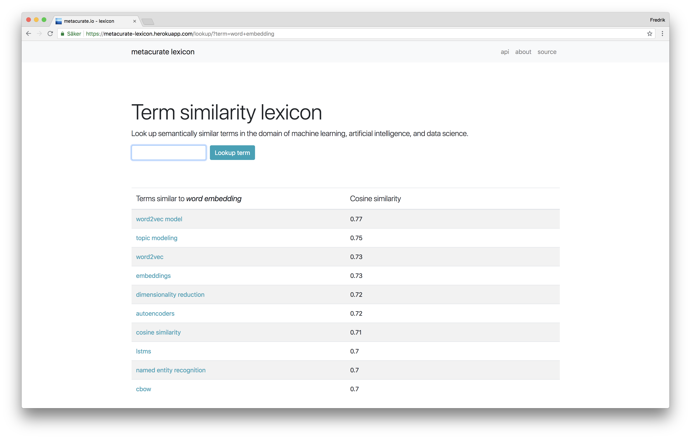
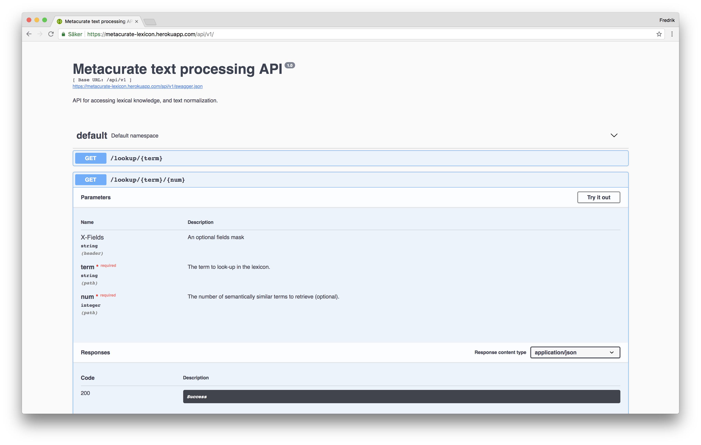

# Metacurate Lexicon

## tl;dr
The metacurate lexicon, and the accompanying API, are the results of an investigation into the feasibility 
to deploy a web service that uses a reasonably large set of word embeddings to platform-as-a-service Heroku.

## Verbose

The metacurate lexicon is available at 
[https://metacurate-lexicon.herokuapp.com/](https://metacurate-lexicon.herokuapp.com/) 
(it is running on a free dyno, so it takes 30 seconds or so to spin it up). 
It is a python/Flask web application that exposes interfaces (a web GUI and a RESTful API) for looking up 
semantically similar (multi-word) terms in a lexicon, as well as the appropriate pre-processing of raw text 
into sentences and term tokens. The word embeddings in the lexicon are generated by the gensim word2vec 
implementation, and the recognition of multi-word terms is based on gensim Phraser:s.

Here's a screenshot of looking up the term *word embedding* in the lexicon:




Here's a screenshot of the automatically generated API docmentation:



## Why?

Upcoming features at [metacurate.io](https://metacurate.io) require access to a lexicon of semantically similar 
multi-word terms. Since metacurate.io is hosted on [heroku](https://www.heroku.com/), 
I wanted to find out whether the required semantic lexicon functionality can be deployed to heroku too,
without violating their application size constraints.

The answer is *yes*.

## How to run the web service locally


To install and run this program you need:

* *Python 3.6* or higher to execute the program. [Download and install.](https://www.python.org/getit/)
* *Git* to get local copy of this repository. [Download and install.](https://git-scm.com/downloads)

I also suggest you use, e.g., [virtualenv](https://virtualenv.pypa.io/en/stable/installation/) to create a virtual environment in which you
install the requirements of this program.

Once the above requirements are in place, at a command line prompt, do the following:

```
$ git clone https://github.com/fredriko/metacurate-lexicon.git
$ cd metacurate-lexicon
```

to clone this repository to your local machine, and 

```sh
$ virtualenv ~/venv/mcl
$ source ~/venv/mcl/bin/activate
```

to set up and activate a virtual environment called `mcl`. To install the python
dependencies of `metacurate-lexicon`, type:

```
$ pip install -r requirements.txt
```

You're done installing the `metacurate-lexicon`. Let's run the server.


## How to deploy the web service to Heroku
